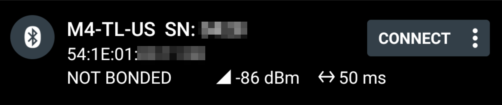
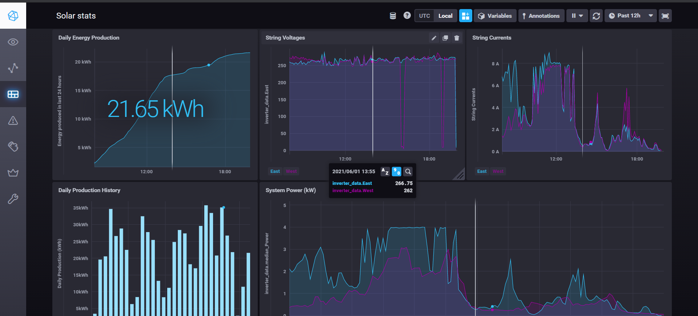

# Solar Inverter Logging Tool

This project can be used to extract real-time production data from a 
[Delta M4-TL-US photovoltaic inverter](https://www.delta-americas.com/Products/CategoryListT1.aspx?CID=0505&PID=3998&hl=en-US&Name=M4-TL-US%20%7C%20M5-TL-US%20%7C%20M6-TL-US%20%7C%20M8-TL-US%20%7C%20M10-TL-US) 
and send it to an [InfluxDB](https://www.influxdata.com/products/influxdb-overview/).
It may work on other M-series inverters, but has not been tested at all (since
I only have one inverter). It likely does not work on other inverters by Delta,
and certainly not for other manufacturer's inverters.

The project has been developed using and runs on a 
[Raspberry Pi Zero W](https://www.raspberrypi.org/products/raspberry-pi-zero-w/),
a small SoC computer that comes with built-in Wifi and Bluetooth, which costs
about $10 (in the US). 

## DISCLAIMER/LICENSE

IMPORTANT, please read!!! 

This software was developed as a personal project without involvement from
Delta Electronics, Inc. The code provided here is unaffiliated with that company,
and has not been tested, reviewed, or endoresed by them in any way
It could potentially have bad side effects (I haven't noticed any
in six months of operation -- it essentially just runs the same bluetooth commands
as the Android application). All applicable copyrights and trademarks are owned 
by Delta Electronics, Inc., and they are used here under fair use. The software
provided here is on an "as is" basis, without warranty or liability. See
the detailed [disclaimer](./DISCLAIMER.md) and [license](./LICENSE) for 
more details.

## Installation

The software has been developed using Python 3.9.1 installed via 
[`pyenv`](https://github.com/pyenv/pyenv) on 
"[Raspberry Pi OS Lite](https://www.raspberrypi.org/software/operating-systems/)".
In general, it sends a number of messages (matching those sent by the
[M Professional](https://play.google.com/store/apps/details?id=com.hdc.donnieli.mprofessional&hl=en_US&gl=US)
app) using the [Bluetooth Low Energy protocol](https://en.wikipedia.org/wiki/Bluetooth_Low_Energy)
and saves the responses it receives as a local JSON file. These files are
then uploaded to an InfluxDB time-series database via Wifi for further plotting
and  analysis, and then discarded (as SD Card space is limited on a Raspberry 
Pi).

### 0. Install Python
This project might work with the default Python 3 version on Raspbian,
but it has not been tested at all. If you'd like to use the 
exact same configuration I used, install 
[`pyenv`](https://github.com/pyenv/pyenv), and then install
version 3.9.1 via `$ pyenv install 3.9.1` (this takes quite a while on
the modest CPU of the Pi Zero...)

### 1. Get the code

To get started, clone/download this repository onto your Pi and
change into the directory containing the files:

```shell
$ git clone https://github.com/jat255/solar-inverter-datalogger.git
$ cd solar-inverter-datalogger
```

### 2. Configuration

This project uses [`dotenv`](https://github.com/theskumar/python-dotenv) to
configure the deployment, including settings such as the Bluetooth MAC
address of your inverter, your InfluxDB server, etc. The repository as 
downloaded contains a file named `.env.example`. Either copy this file
or rename it to `.env`, and edit the values that match your setup.

The MAC address for your inverter is a little tricky to find, since
it's not printed on the label (there is a MAC address on the label, but it is
not the right one). The easiest way to get that value is to use an app
like nRF Connect ([Android](https://play.google.com/store/apps/details?id=no.nordicsemi.android.mcp) / [iOS](https://apps.apple.com/us/app/nrf-connect-bluetooth-app/id1054362403)),
stand right next to your inverter, and run a scan with your phone. Among 
probably many other devices, you should see something like the following:



You should see the name "M4-TL-US", together with your inverter's serial
number, and then underneath is the Bluetooth MAC address (mine starts with
`54:1E:01`). That value is the MAC address you should put in the `.env` file. 

## Other required setup

You'll need an InfluxDB server somewhere to receive the logged data that can
be accessed via the network. This document won't cover all the details, but
this can be run on a server you have locally, in something like AWS or Google
Cloud, or on a virtual private server such as Digital Ocean or one of their
competitors. Whatever it is, it should be accessible all (or most of) the time, 
since you won't be able to view the data without it. The code in the Pi Zero
*will* however only delete the local logs once they've been successfully 
uploaded, so a computer that's not on *all* the time might still work okay.
I recommend using the [`influx:1.8.6`](https://hub.docker.com/layers/influxdb/library/influxdb/1.8.6/images/sha256-19de5def6a422ee0d0735018ea9394971f15907abde0fc1c66930757677b8b4a?context=explore)
Docker image to get things set up easily.

#### Login to InfluxDB and create a database

Login to your system running Influx (or connect remotely) and create a database.
Connecting to your database may look a little different depending on how you've
set up authentication. The easiest way I know is to ssh onto the computer
running the actual `influx` command:

```shell
$ influx   # this command opens the influxdb client -- add connection info if connecting to a remote db
> CREATE DATABASE solar_stats
```

## Visualizing the data

Once the data is in your InfluxDB, you can use tools like Chronograf or
Grafana to visualize it. I've created a small dashboard for Chronograf 
(`solar_stats_chronograf_dashboard.json`) that can be imported into Chronograf
and used as a starting point for your own visualizations:


